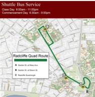

# realtimebustracker
[Return to Home](https://scottbdavis.github.io/scottbdavis/)
### Name: 
MIT Web Dev Exercise for Week 8 (files are labeled Week 7 due to MIT starting with 0 week)

#### Description: 
Description of the project: shows progression of bus stops from MIT to Harvard with button and map style changes

#### Installation: 
load files in preferred IDE - VS Code was used for the original coding
How to Run: Obtain a unique API from mapbox and insert after mapboxgl.accessToken = "

#### Usage: 
Review DOM, looping, and setTimeout concepts

#### Support: 
MDN and W3 schools contain detailed info on these concepts and an alternate pacman project helped to walk through DOM manipulation techniques https://www.youtube.com/watch?v=GOJBoGbRNQA

#### Roadmap: 
Roadmap of future improvements: Would be helpful to have alternate routes animated as well or routes to other key locations

#### License information: 
see MIT license release in repository.

